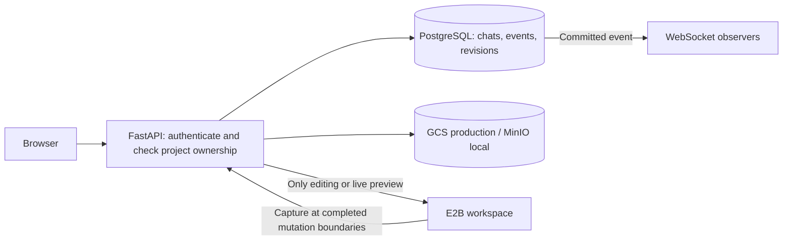

# Durable project files and run history

Status: accepted; local implementation added. See [setup and verification status](../persistence-setup.md). The remainder records the original proposal. Researched 13 September 2026 against the current working tree (base commit `67150730`). Existing uncommitted auth/profile work is outside this change. No cloud credentials were read or used, no storage resources were created, and no live storage tests were run.

The [council report](../council/council-report-2026-09-13-persistence.html) and [full transcript](../council/council-transcript-2026-09-13-persistence.md) record five simulated perspectives and peer reviews. They are a structured design exercise by one assistant, not independent model validation.

## Decision

Keep PostgreSQL for ownership, chats, ordered activity and revision metadata. Store immutable, compressed project revisions in private GCS in production and MinIO locally. Treat E2B as temporary compute. Reading saved files, downloading source and reading logs must work without E2B or an LLM call.

Use the native GCS Python client with ADC/service-account credentials and an S3 client for MinIO behind three small operations: upload an immutable object, read an object, delete an object. This is two real implementations, not a general storage framework. Use SDK timeouts/retries and bounded thread offloading for synchronous SDK I/O. Do not introduce a queue service, Redis, Kubernetes, a filesystem mount, automatic model resumption, or one Git repository per project in v1.

## What the current code actually does

| Evidence | Current behavior | Consequence |
| --- | --- | --- |
| `agent/service.py:109–126` | Publishes events from memory; periodically replaces `Run.events` JSON in PostgreSQL. | Events shown after the last checkpoint can disappear on a crash. Each checkpoint rewrites previous events. |
| `agent/service.py:128–175` | Restores from `projects/<chat>/`; saves text files individually and then replaces metadata. | Atomic individual files do not make an atomic project revision. Failed reads are skipped. Images/fonts are skipped. |
| `agent/service.py:192–246` | Saves after successful verification, best-effort on ordinary failure; stop/timeout skip the final save. | Changes since the last complete save can be lost. Saving earlier must not slow cancellation. |
| `main.py:157–254` | File list, file content and ZIP routes require a live sandbox. | A saved project may become unreadable through the UI once the sandbox expires. |
| `deploy/compose.yaml:10–25` | Host bind mount for projects; API memory 512 MiB; `/tmp` 32 MiB; Docker log rotation 3 × 10 MB. | Files survive container replacement, not VM/disk loss. Console logs are bounded local diagnostics, not durable history. |
| `db/models.py` / `agent/runner.py` | Chats, messages, run summaries and bounded tool/check output already exist. New runs load selected files and the new prompt. | Preserve these contracts; restoring files is different from restoring a full model conversation or resuming an interrupted process. |

## Open-source grounding

GitHub metadata was fetched on the research date. Stars show adoption, not proof that a particular design is suitable.

| Project | Observed pattern | Use here |
| --- | --- | --- |
| [OpenHands](https://github.com/OpenHands/OpenHands), 87,672 stars | Its current backend components are split into other repositories. The [SDK EventLog](https://github.com/OpenHands/software-agent-sdk/blob/main/openhands-sdk/openhands/sdk/conversation/event_store.py) persists ordered events with duplicate-ID checks and locking. | Commit activity before publishing it; retain stable event identities. Do not copy the entire agent framework. |
| [OpenHands Cloud configuration](https://github.com/OpenHands/OpenHands-Cloud/blob/340014fce035abfbd9c2d5c0875bc3034253446a/charts/openhands/values.yaml#L139), 77 stars | Explicit GCS/S3 session storage, bundled MinIO option, and separately configured workspace archiving. Archiving is disabled by default. | Separate conversation durability from filesystem durability. Configuration support is not proof of a tested deployment. |
| [bolt.diy](https://github.com/stackblitz-labs/bolt.diy/blob/2e254ac19a696394030601bc602f54945b12bfc4/app/lib/persistence/db.ts), 19,868 stars | IndexedDB stores chats and snapshots; snapshots have explicit read/write operations. | Useful separation of chat and workspace snapshots. Browser storage is insufficient as our cross-device source of truth. |
| [Open Lovable](https://github.com/firecrawl/open-lovable/blob/69bd93bae7a9c97ef989eb70aabe6797fb3dac89/lib/sandbox/sandbox-manager.ts), 28,397 stars | The inspected manager caches sandbox providers in a process-local Map and attempts reconnection. | Reconnection is an optimization, not a durable backup. This is a finding about the inspected manager, not a claim that every persistence path in the repository is absent. |

Inspected tree commits: OpenHands `28464621d879e3e9b3ceeae9d70a71d96da6212d`; bolt.diy `2e254ac19a696394030601bc602f54945b12bfc4`; Open Lovable `69bd93bae7a9c97ef989eb70aabe6797fb3dac89`; OpenHands Cloud `340014fce035abfbd9c2d5c0875bc3034253446a`. The SDK EventLog source was retrieved separately, blob SHA `ddfd38f13662ddb7c28e4d5142862e91d05716ca`; do not attribute it to the frontend repository's commit.

## Data ownership

| Data | Durable home | Rule |
| --- | --- | --- |
| User, chat, prompt, assistant summary, usage and terminal outcome | PostgreSQL | Keep existing ownership and credit transactions. |
| Ordered activity events | New `run_events` rows, unique `(run_id, sequence)` | Bounded/redacted payload; persist before WebSocket publish; reconnect with `after_sequence`. |
| Project source and allowed binary assets | One ZIP per changed revision | Preserve paths and bytes. Exclude secrets, dependencies and build caches. |
| Revision manifest, hash, size, template identity, status and object key | PostgreSQL `project_revisions` | A manifest is the authoritative file list, including deletions. No bucket listing on ordinary reads. |
| Expanded diagnostic output | Bounded DB payload while active; one compressed JSONL archive per finished run | Archive only if there is expanded output. Retain short event summaries for replay. Prune expanded DB payload only after archive verification. |
| General API/proxy console logs | Existing rotated local logs | Explicitly not promised as permanent history. Keep essential error class, run ID and stage in durable run diagnostics. |

Never archive `.env*`, credentials, bearer tokens, provider request headers, `node_modules`, `.next`, `dist`, or raw hidden reasoning. Store useful tool results, sanitized errors, model name, token usage, timings and build/browser outcomes. Diagnostic truncation must be labeled with original byte count; do not silently claim complete raw logs.

## Revision protocol

1. After each completed mutating tool batch, capture a consistent workspace while the editor is paused. Commands may change files even when they fail. Fence background mutations and detect files changing during packaging; pausing model requests alone does not guarantee consistency. Capture includes binary bytes, path, size and SHA-256 per file. Reject traversal, symlinks, duplicate paths and exceeded limits. Fail the save explicitly if an included file cannot be read.
2. Derive a stable content hash from sorted paths and byte hashes, independent of ZIP timestamps. If unchanged, reuse the saved revision; do not upload another copy. Record the E2B template/build identity and lockfile for restoration.
3. Insert a pending revision with deterministic object identity. Upload a complete ZIP to a private, immutable key scoped by owner and project. Confirm SDK checksum and object metadata. A pre-existing retry target must match expected hash/size; an ETag is not assumed to be SHA-256.
4. In a PostgreSQL transaction, lock the project, verify the expected parent revision, mark the new revision ready, update the project pointer, and insert the `checkpoint_saved` event. Only then tell the UI the revision is saved. On final success, commit the run summary, terminal event and verified revision reference together.
5. Keep `latest_saved_revision_id` and `latest_verified_revision_id` separate. A failed build can have a useful recoverable draft without replacing the last verified preview. Restoring a draft requires clear labeling.

There is no transaction spanning PostgreSQL and object storage. Pending rows bridge that gap: startup reconciliation promotes a fully verified upload or marks it failed, and later removes unreferenced objects. Readers follow ready database references only. An upload failure leaves the old revision usable and gives a persistence-specific error; retry storage, never automatically rerun a paid generation.

The guarantee is **last acknowledged checkpoint survives loss of the sandbox and API process**, assuming PostgreSQL and the object store remain available. A crash during the current mutation can lose its unacknowledged edits. Cancellation stops immediately and preserves the last checkpoint; it must not wait for a new full archive. After a process restart mark runs interrupted, reconcile saved data and require a new user request before running more paid work.

## Read, download and restore

File list comes from the manifest. Individual source reads use the saved ZIP through an evictable local cache keyed by revision hash; do not allocate E2B. Downloads stream the saved ZIP through the ownership-checked API initially. A short-lived, exact-object signed download URL is optional later if bandwidth measurements justify it; never persist signed URLs as identifiers. Generated HTML/SVG are untrusted and must not run on the authenticated application origin.

For an edit or explicit live-preview request, create/reuse E2B, restore the chosen ready revision into a clean workspace, remove template files absent from the manifest, and install dependencies using its pinned lockfile when necessary. Verify all paths/checksums and enforce extraction size limits. If an existing revision cannot be restored, fail clearly rather than opening an empty template and overwriting the project.

A sandbox URL is a lease, not a saved deployment. Show “Preview sleeping” after expiry, with an explicit reopen action that explains compute will start. Reading source or logs uses neither E2B nor the model. A permanent public deployment is a separate feature.

Generated applications' databases and user-uploaded runtime data are a separate persistence scope. Source archives do not back up an external database, and do not promise recovery of application data stored only inside a sandbox. Document that boundary in the workspace.

## Logs without a large logging platform

Preserve the existing 200-event run budget. Each compact event is inserted once, with its existing sequence/event ID; replace whole-array checkpoints with event inserts. Persist first and publish second. If the database is unavailable, stop admitting/mutating work instead of broadcasting false durable progress.

Keep command output bounded (proposal: at most 1 MiB expanded diagnostics per run, with clear truncation) and redact before it touches durable storage. Completed runs get one optional compressed archive, not one object per log line. Crash recovery archives the diagnostics already committed to PostgreSQL. Event pages must remain queryable beyond the current last-10-runs view. Retain IDs and summaries after detailed output expires; archive failure is distinct from build success and source save status.

Do not feed every stored log or every old message back into each model call. Use the current prompt, selected files, last relevant summary and requested diagnostics. This saves model tokens as well as storage.

## GCS and MinIO contract

Use GCS native `google-cloud-storage` with SDK checksum validation and generation preconditions for immutable creation (`if_generation_match=0`). Context7 resolved `/googleapis/python-storage` and supplied upload/retry documentation. [Official retry guidance](https://docs.cloud.google.com/storage/docs/retry-strategy).

GCS has partial S3/XML interoperability using HMAC credentials; an existing Google service-account JSON or ADC credential is not an S3 access key. Prefer two small native adapters over introducing an extra long-lived HMAC credential solely to reuse one SDK. [GCS interoperability](https://docs.cloud.google.com/storage/docs/interoperability).

Local Compose should add only MinIO and a persistent named volume alongside PostgreSQL. Keep frontend/backend as separate development commands. Bind API/console to localhost, require ignored local credentials, create a private development bucket idempotently, and pin a reviewed image/source build. Do not mount production credentials into local MinIO.

The [MinIO community repository](https://github.com/minio/minio) currently states it is archived, unmaintained and source-only. Respect the requested local MinIO choice, but do not use an unverified `latest` image or position it as the production durability layer. MinIO tests cannot prove GCS IAM, signing, retry or generation behavior; one explicitly approved private GCS contract probe is needed before release.

## Cost controls and proposed limits

- Start with regional Standard GCS, not Nearline/Coldline/Archive for actively edited files. Avoid automatic storage-class transitions initially.
- Write one compressed object per changed checkpoint; reuse hashes. Bundle files rather than issuing hundreds of small object writes. Capture/package in one sandbox operation where possible instead of reading every file over separate SDK calls.
- Proposal: 250 files, 32 MiB uncompressed / 10 MiB compressed per project revision, 5 retained ready revisions per project plus any pinned latest verified revision. Always retain the current ready revision. These are product limits to implement and test, not measurements of current projects.
- Keep expanded run diagnostics 14 days, compact history 30 days initially, and latest project source until the user deletes it. User-visible expiration text must match. Older revision cleanup is reference-aware; never put a blanket age-expiry rule on all source ZIPs.
- Keep active-run checkpoints until termination; clean superseded ones afterwards. Garbage collection must skip pending/active records, use a grace period and verify live references before deletion. Account/project deletion first revokes DB access, then retries object cleanup.
- Cap concurrent transfers at the current two-run limit; stream with bounded buffers and a bounded local cache. The current 32 MiB tmpfs cannot safely hold two expanded 32 MiB archives. Package/extract inside E2B or use a deliberately bounded disk scratch mount; do not silently enlarge RAM-backed storage on the 512 MiB API.
- Add per-user/project storage caps, per-run checkpoint limits bounded by the existing mutation budget, and application-wide storage/write/egress admission limits. Alerts alone do not enforce a hard spending ceiling. Measure E2B runtime and model tokens separately.

Illustrative storage-only calculation, not an account quote: 10 GiB retained, 6,000 writes and 20,000 reads/month at approximately $0.02/GiB-month, $0.005/1,000 Class A operations and $0.0004/1,000 Class B operations is about **$0.24/month before free allowances and network charges**. This excludes database, Oracle, E2B, model usage, taxes and extra billed retained copies. [GCS pricing](https://cloud.google.com/storage/pricing).

GCS lists a free allowance of 5 GB-months, 5,000 Class A and 50,000 Class B operations in eligible US regions (`us-east1`, `us-central1`, `us-west1`), aggregated across them. It also lists eligible transfer allowances; actual Oracle/browser destinations, account eligibility and all other project usage must be checked before forecasting zero cost. A local MinIO container has no GCS usage charges.

Soft-deleted and noncurrent objects can still incur storage charges. Keep a short explicit recovery policy (proposed 7-day soft delete for source), avoid redundant automatic object versioning because revisions already have immutable keys, and account for this retained data. Detailed disposable logs can use a separate bucket with a different policy; never disable recovery on existing user data silently. [Soft delete](https://docs.cloud.google.com/storage/docs/soft-delete).

## Migration and acceptance

First implement one vertical slice: save a revision, kill the sandbox, then list/read/download it through the existing owned routes using MinIO. Its proof is byte-for-byte restored source and binary assets after API restart without any model call.

Then add ordered durable events, checkpoint hooks at mutation boundaries, and source/log retention. Import existing v1/v2 `projects/` snapshots idempotently. Keep legacy files as rollback material until the imported hashes and ownership are verified; missing/skipped legacy binary files cannot be reconstructed from metadata alone. Use a live sandbox export only when it still exists and the user authorizes the compute.

Backfill existing `Run.events` into rows with unchanged event IDs/sequences; retain an explicit legacy-read branch until migration completes, not permanent dual writes. Preserve the current WebSocket event format and migrate reader/writer ordering safely. Never reclassify an interrupted run as successful because a snapshot exists.

Acceptance matrix before production: text/binary round-trip; renamed/deleted file; empty project; snapshot over size limit; sandbox expiry; API crash before upload / after upload before DB commit / after commit before publish; storage outage; duplicate upload retry; simultaneous stale-parent save; cancel during mutation; missing/corrupt object; ZIP traversal/symlink/bomb rejection; cross-user denial; event replay without duplicates; expired signed link if enabled; safe migration repeat; deletion/retention never removes a current revision. Run these locally first. A separate approved GCS probe must test the real provider and clean up only its own temporary objects.

Credential setup, bucket region/permissions/billing, actual project sizes, restoration runtime and storage costs remain unverified. Research completion is not deployment completion.
