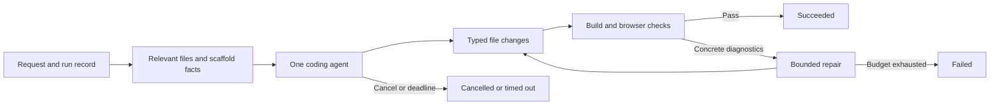

# WebBuilder orchestration audit — 12 September 2026

Scope: investigate the pasted search-page run, inspect deployed source at `c03507d62174bd0439da703d5a767f71deb659b7`, and compare established public app builders. This is a research report; no application changes or deployments were made during this audit.

Follow-up: the [implementation and verification record](../architecture/orchestration.md)
addresses these findings. This report preserves the original evidence and historical line references.

The main problem is execution control and truthful state reporting. Changing the model or replacing LangGraph alone would leave the concrete faults below intact. The earlier deployment smoke checks established connectivity and a small successful generation, but were insufficient evidence of orchestration reliability; the fake build check should have been caught.

## What happened in the supplied run

Production lifecycle logs for project `530f0393-8003-4259-954f-23adf33d5bbf` show:

- WebSocket accepted: **06:44:54 UTC**.
- Incoming-message timeout: **06:50:08 UTC**.
- Agent task cancelled: **06:50:09 UTC**.

The persisted conversation contains **44 tool-start records and 44 tool-completion records**, including **21 reads**, 11 individual file writes, two batch-write attempts, four shell calls, and one dependency scan. There is no persisted terminal completion record. Four identical name/input groups occur twice. These are event records, not independently metered provider calls; the current schema lacks the IDs needed to establish billing or deduplicate nested/replayed events conclusively.

The pasted UI reports 45 calls and repeats outputs. Its display is not an accurate execution ledger: one completion updates every running tool with the same name, regardless of its arguments. Therefore repeated App.jsx output rows do not establish that every corresponding tool invocation actually read App.jsx.

## Confirmed defects

### 1. Transport inactivity cancels active work; the UI remains busy

`main.py:463` waits 300 seconds for **incoming JSON**. Streaming output does not reset that timer. Once it fires, the handler exits and its `finally` block cancels the agent (`main.py:588`). A user watching a long generation without typing can trigger this.

The frontend close handler only updates `wsConnected` (`frontend/app/chat/[id]/page.tsx:262`). It does not clear `isBuilding` or the current tool. The backend emits `completed`, while the frontend's explicit completion cleanup expects `workflow_completed` (`frontend/lib/websocket-handlers.ts`). A URL happens to clear one flag on successful completion, but cancellation and failures do not have equivalent terminal handling.

**Consequence:** this run had stopped on the server while the UI still appeared to be processing. There is also no durable run record from which reconnecting clients can recover the correct state.

### 2. Build and validation success are unreliable

- `agent/tools.py:249`: `test_build()` unconditionally returns `"build success"`; it executes nothing.
- `agent/graph_nodes.py:634`: the validator initializes `validation_errors = []`, but its normal event loop never populates that list from tool failures. An agent ending normally is treated as validation success.
- `agent/graph_nodes.py:721`: the application checker only checks that three files can be read. It explicitly skips dev-server checks and sets success without compiling or checking browser execution.

**Consequence:** a broken app can receive a green completion. An HTTP 200 for a Vite shell is also insufficient proof that its React application renders correctly.

### 3. Dependency detection fabricates repair work

`agent/tools.py:499` extracts the first slash-separated segment of import strings. Relative imports become `.` or `..`; scoped package names are also mishandled, and only `dependencies` is considered. The pasted run explicitly contains suggested `npm install .` and `npm install ..` commands.

The validator prompt tells the agent to run this scanner first and follow its install instructions. This connects a faulty heuristic directly to a tool that mutates dependencies. The evidence shows the bad recommendation; it does not establish that those two install commands were actually executed.

### 4. Errors are represented as successful tool results

Tools generally catch exceptions and return an error-shaped string. `handle_agent_event` then persists every tool end with `status: "success"` (`agent/graph_nodes.py:120`). The frontend repeats that assumption and matches by tool name (`frontend/lib/websocket-handlers.ts:86`).

This explains the green checks beside failed JSON batch writes. Start and finish are also stored as separate conversation messages; history consolidation concatenates their tool arrays rather than joining them by call ID. Counts can change after reloading.

### 5. The workflow demands repeated broad work

The fixed route is planner → builder → editing validator → file-presence checker. Both builder and validator create fresh ReAct loops with all ten tools and `recursion_limit: 50`. The validator receives no compact builder action ledger or validation findings; its prompt demands reading every source file and repairing anything it notices.

The planner requests a comprehensive architecture without the builder's JSX-only, existing-scaffold, default-single-page constraints. In the supplied output it proposes TypeScript configuration despite the JSX scaffold. The builder is then told to create every file in the plan and not stop until that is done. It is also told to write files one by one, conflicting with the system prompt's preference for batches.

There are LangGraph step limits, so it is incorrect to call the system literally unbounded. However, these are graph-step limits, not a global tool-count, elapsed-time, or spend budget. A step can contain multiple tools. Re-entering a node creates a fresh inner agent. The ten-minute timeout messages have no corresponding whole-agent timeout wrapper. Validation exception/timeout paths also do not advance the validation retry counter.

### 6. File tools can create their own failures

`write_multiple_files(files: str)` asks the model to embed an entire file array as a JSON string inside tool-call JSON and then parses it again. The supplied run contains two `Extra data` parsing failures. A typed array of file objects would eliminate this extra serialization layer.

Both write tools additionally run `content.encode("utf-8").decode("unicode_escape")`. This can corrupt Unicode and valid JavaScript escape sequences after JSON has already decoded the text. The pasted run searches for `â`, consistent with mojibake, although this alone does not prove the origin of every damaged character.

### 7. Logging adds latency but lacks correlation

Each tool start and finish awaits a separate database write in the event-consumption path. The supplied run has 88 such records. This adds database work between model/tool events; its exact latency contribution has not been measured.

Events lack a stable run ID, tool-call ID, stage, elapsed duration, attempt, usage, and explicit terminal reason. Chat text, progress events, and tool records are merged for display. Runtime WebSocket access logs also include query-string authentication tokens; these must be redacted or excluded from access logging. No token values are included in this report.

## Public projects examined

GitHub API snapshots checked on 12 September 2026. These are relevant high-star references, not a claim to be a complete global ranking. Stars measure adoption, not correctness.

| Project | Stars | Last repository push reported by GitHub | What to borrow |
|---|---:|---|---|
| [Dyad](https://github.com/dyad-sh/dyad) | 21,484 | 11 Sep 2026 | Explicit cancellation, terminal UI events, tool-call identity and bounded repair of concrete errors |
| [bolt.diy](https://github.com/stackblitz-labs/bolt.diy) | 19,868 | 7 Feb 2026 | Action IDs, execution state, deduplication and an ordered action runner |
| [Open Lovable](https://github.com/firecrawl/open-lovable) | 28,397 | 19 Nov 2025 | Separate code generation from applying file artifacts; useful simple sandbox example |
| [OpenHands](https://github.com/OpenHands/OpenHands) | 87,579 | 12 Sep 2026 | Agent-runtime reference: repetitive-loop detection and typed execution states in its SDK |

**Dyad:** its [stream handler](https://github.com/dyad-sh/dyad/blob/0c8403662504264f911242504fc2d2b07895c6ad/src/ipc/handlers/chat_stream_handlers.ts#L658) aborts tracked streams and sends terminal events before waiting for cleanup. [Tool events](https://github.com/dyad-sh/dyad/blob/0c8403662504264f911242504fc2d2b07895c6ad/src/ipc/handlers/chat_stream_handlers.ts#L904) preserve call IDs and distinguish errors. Its [search/replace repair loop](https://github.com/dyad-sh/dyad/blob/0c8403662504264f911242504fc2d2b07895c6ad/src/ipc/handlers/chat_stream_handlers.ts#L2800) caps attempts at two and checks cancellation. This is a concrete bounded repair path, not a claim that all Dyad workflows have the same limit. Its repository has mixed licensing, including restricted Pro code; inspect file licensing before reuse.

**bolt.diy:** the [action runner](https://github.com/stackblitz-labs/bolt.diy/blob/2e254ac19a696394030601bc602f54945b12bfc4/app/lib/runtime/action-runner.ts#L90) ignores duplicate action IDs, avoids re-executing completed actions, queues execution, and records complete/failed/aborted states. Its browser runtime differs from our E2B backend. Borrow the action protocol rather than copying its hosting architecture.

**Open Lovable:** its [generation endpoint](https://github.com/firecrawl/open-lovable/blob/69bd93bae7a9c97ef989eb70aabe6797fb3dac89/app/api/generate-ai-code-stream/route.ts#L1250) streams generated code; a separate [application endpoint](https://github.com/firecrawl/open-lovable/blob/69bd93bae7a9c97ef989eb70aabe6797fb3dac89/app/api/apply-ai-code-stream/route.ts#L66) parses file artifacts and consolidates duplicate paths. It also has heuristic parsing and retries. It is an example to learn from, not a production reliability guarantee or an unconditional rewrite target.

**OpenHands:** its current [SDK stuck detector](https://github.com/OpenHands/software-agent-sdk/blob/9c3571a694547734002518bd94b3cb41a187f9b6/openhands-sdk/openhands/sdk/conversation/stuck_detector.py#L24) checks repeated action/results, repeated errors, alternating loops and other unproductive patterns. Its [conversation state](https://github.com/OpenHands/software-agent-sdk/blob/9c3571a694547734002518bd94b3cb41a187f9b6/openhands-sdk/openhands/sdk/conversation/state.py#L48) explicitly represents running, paused, finished, error and stuck. Borrow these controls; a full general-purpose coding platform is unnecessary for this small app.

LangGraph's [documented recursion guard](https://docs.langchain.com/oss/python/langgraph/GRAPH_RECURSION_LIMIT) and the installed prebuilt agent's `remaining_steps` behavior confirm that step limits exist. Our missing policies are global execution budgets and reliable terminal-state propagation.

## Recommended target

Keep Vercel, the small Oracle API, Neon and E2B. Start by repairing the application protocol. Keep LangGraph initially if convenient; framework replacement is not a prerequisite.

- One agent owns edits. Use a short plan only when scope warrants it. Do not require a second model to reread and rewrite the entire project after every build.
- Supply the installed package manifest, relevant files and scaffold constraints up front. Cache reads by path and content version; invalidate after writes. Serialize conflicting writes.
- Use typed tools and results: `read_files`, `write_files`/patch, and bounded shell execution. Preserve source text exactly. Restrict dependency changes to explicit, validated package names.
- Run real deterministic build checks. Test preview readiness and browser errors separately. Feed only concrete diagnostics to a limited repair loop.
- Give each run a persisted status and each tool call a stable ID. Store `queued/running/succeeded/failed/cancelled/timed_out`, timestamps and terminal reason. A WebSocket observes a run; merely losing the socket should not silently decide its outcome. Provide an explicit cancel operation and reconnect/status recovery.
- Enforce a whole-run deadline, model-turn and tool-call limits, and usage budget. Detect repeated unchanged action/result pairs. Initial small-app limits such as two repair passes are proposed defaults to evaluate, not measured optimal values.
- Stream concise stage summaries to users. Keep expandable command diagnostics, exit codes, durations and IDs. Record usage per completed run, with logs redacted. Use a bounded event buffer; commit stage transitions and terminal state reliably.

## Implementation order and acceptance evidence

1. **Truth and termination:** remove fake build success; fix dependency parsing and file serialization; propagate tool errors; unify terminal events; implement cancellation and deadline handling. Require a failure to be visibly failed and an idle viewer not to cancel an active run.
2. **Bounded orchestration:** replace the mandatory editing validator with real checks and targeted repair; unify scaffold constraints; add call IDs, global budgets and repeat detection. A successful build must not trigger an unconditional full-source review.
3. **Quality measurement:** evaluate a landing page, counter, multi-page app, small edit, intentional compile failure, Unicode content, tool error, cancellation and reconnect. Capture completion rate, actual calls, repeated reads, elapsed time, usage/cost and verified browser behavior. Then compare low-cost models by cost per successful task.

No new builds, model generations, automated tests or production modifications were run for this audit. Evidence consists of the supplied transcript, source inspection, read-only production event/lifecycle data, current GitHub metadata and pinned upstream source snapshots. The MCP graph lookup timed out; Graphify and direct source reads provided the local navigation fallback.
